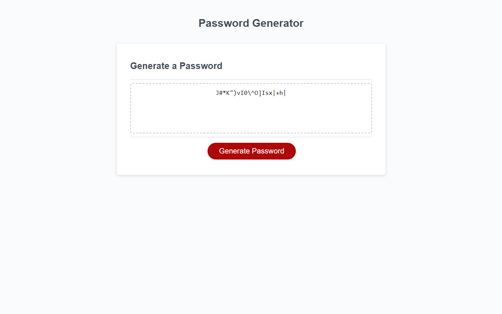

# Password Generator Starter Code

## Description

- The motivation behind this project was to help users create secure passwords
- This project was built with security in mind. To help users protect their information from hackers
- This project was built to solve the issue of weak passwords. With our technology, we can create strong passwords that are hard to hack
- Many new things were learned from the creation of this project. Some of those things were do/while loops, how to select random values from an array, problem solving and brain storming ideas. Many different ideas were attempted but ultimately failed. Getting to the end result was a long and strenuous journey but also fulfilling and exciting, to be able to solve.

## Usage

- Open up the console to view your password's details. You will be able see the characters being used, the length and the password itself.

Link to deployed website[https://0mar77.github.io/covert-byway/]

